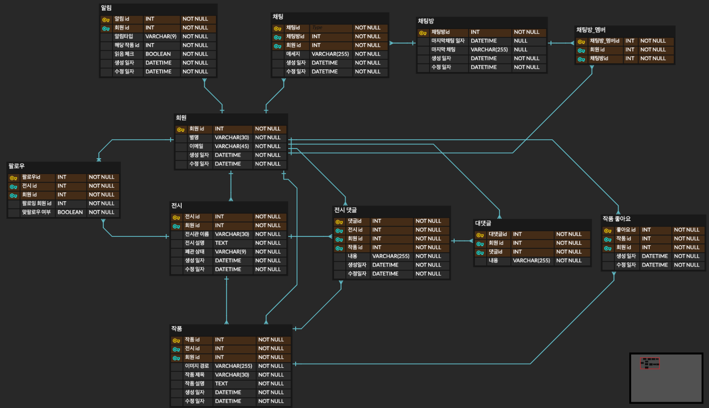
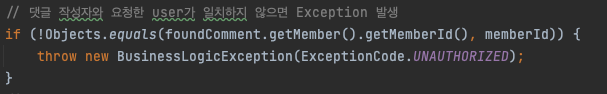
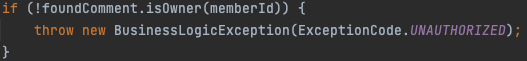

# oneyearfourcut-refactoring

(프로젝트 ERD)
## 리팩터링 목표
1. ~~API 테스트 작성~~
2. ~~엔티티에 setter 없애기~~
3. 객체지향적 코드 설계 
4. 높은 의존성 낮추기 (e.g. 상위 도메인이 하위 도메인에 의존하지 않기)
5. 필요없는 경우 양방향 맵핑 하지않기 
6. JWT 방식에서 세션 방식으로 변경 해보기 
7. 단위 테스트 작성 
8. 테스트 커버리지 측정 
9. ERD 수정 (나중?)

## 진행상황

---
##  (1/29) API 테스트코드 구현

비지니스 로직이나 설계 자체가 바뀔 예정인데 할때마다 제대로 동작하는지 Postman으로 확인할 수 없으니 이를 대신할 테스트를 먼저 구현한다.

구현 주의사항
1. 각 테스트는 독립적으로 시행되도록 (다른 테스트에 영향주지 않게)
2. 각 테스트마다 필요한 데이터를 셋업해주는 방식으로

---
## (2/18) E2E 테스트코드 구현완료
- 핵심 도메인인 Gallery, Artwork, Comment, Like에 대한 테스트코드만 구현함
- 해당 도메인만 일단 수정하기로

---
## (3/5) 엔티티 setter 제거
- 엔티티에 값을 setter로 변경할 수 없게 최대한 제거, setter를 사용하던 로직들 수정 
- @NoArgsConstructor(access = AccessLevel.PROTECTED)를 적용

---
## (3/9) 비지니스 로직 수정
- [자바 플레이그라운드 with TDD, 클린 코드](https://edu.nextstep.camp/c/9WPRB0ys/) 강의를 들으면서, 클래스 변수에 get을 통해 접근하는 것보다 객체에게 메서드로 물어보는게 좋은 객체지향적 설계라는 설명을 듣고 수정

  (변경 전)

  (변경 후)

---
## (3/11) 테스트 코드 트랜잭션 삭제
- sse 방식으로 알람을 전송하기 때문에 커넥션 풀 부족 현상이 일어나기 쉬워 OSIV를 비활성화 해야함
- 그러기 위해서는 Lazy Loading Exception이 발생하는 것을 테스트에서 확인할 수 있어야하기 때문에 트랜잭션이 없는 테스트를 구현해야함
- 테스트 코드에서 @Transaction을 제거했으며 @BeforeEach, @AfterEach로 데이터 초기화 실행
- Gallery 도메인의 비지니스 로직에 Lazy Loading하는 부분이 있어 로직 일부 수정

---

해야할것
1. 테스트에 트랜잭션 제거하기
2. 